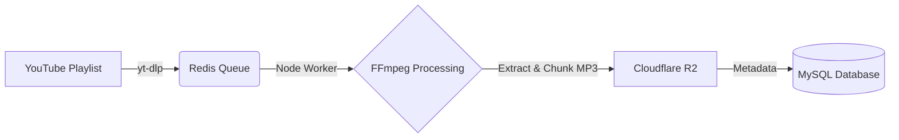

<div align="center">
  
  <h1>🎧 YouTube Audio Pipeline</h1>
  <p>
    <i>Hệ thống tự động hóa: Quét Playlist YouTube ➡️ Tải & Cắt MP3 ➡️ Lưu trữ Cloudflare R2 ➡️ Đồng bộ Database</i>
  </p>

  <!-- Badges -->
  <p>
    
    
    
    
    
    
  </p>
</div>

---

## 🌟 Chức năng cốt lõi (Core Features)

- **🔄 Tự động đồng bộ**: Quét các playlist YouTube theo chu kỳ (Cron-based) để phát hiện video mới.
- **🎧 Xử lý Audio (FFmpeg)**: Tải video từ YouTube thông qua `yt-dlp` và tự động bóc tách, cắt âm thanh định kỳ (VD: 30 phút/phần).
- **🚀 Storage Tối Ưu**: Tự động upload file thành phẩm lên **Cloudflare R2** (hoặc AWS S3), tiết kiệm mạng nội bộ và tối ưu chi phí lưu trữ, phục vụ luồng streaming mạnh mẽ.
- **🚥 Quản lý Hàng đợi (Queue)**: Sử dụng **Redis** để quản trị các tiến trình xử lý ngầm (Worker queues), đảm bảo không bị quá tải máy chủ (OOM) hay nghẽn băng thông.
- **🗄️ Ánh xạ Dữ liệu Thông minh**: Tự động nhận diện, làm sạch tên truyện (loại bỏ cú pháp `[...]`), tạo đối tượng tương ứng và đồng bộ cấu trúc vào cơ sở dữ liệu (MySQL).

## ⚙️ Kiến trúc Hệ thống (Architecture)

Quy trình hoạt động (Pipeline) diễn ra theo luồng (Skeleton Pipeline):


## 📝 Quy tắc Nghiệp vụ (Business Rules)

1. **`1 Playlist = 1 Truyện`**.
2. Ưu tiên `Playlist title` để parse dữ liệu khởi tạo truyện.
3. Bỏ toàn bộ nội dung trong `[...]` khi parse tên.
4. Format mong đợi khi xử lý là: `Tên truyện | Tác giả`.
5. Ẩn hỗ trợ video private/unlisted trong giai đoạn hiện tại.
6. Truyện đối tác mới sẽ được tự động gắn quyền `SYSTEM_USER_ID=13`.
7. **Không sử dụng** thumbnail YouTube làm `anh_bia` (ảnh bìa tạm).

---

## 🚀 Triển khai trên VPS (Production Azure/AWS/DigitalOcean)

Hệ thống được thiết kế để vận hành liên tục và ổn định trên VPS thông qua **Docker Compose**. File cấu hình mẫu cho môi trường production nằm ở `.env.azure.example`.

### 1️⃣ Chuẩn bị Môi trường

1. Đảm bảo VPS đã cài đặt sẵn **Docker** và **Docker Compose**.
2. Clone repository về:
   ```bash
   git clone <repo_url>
   cd crawl-audio-youtube
   ```
3. Khởi tạo file biến môi trường từ template:
   ```bash
   cp .env.azure.example .env
   ```
4. Cập nhật `.env` với các thông số thật (DB host, Redis host, R2 credentials...).

### 2️⃣ Cấu hình Khuyên dùng (Production Best Practices)

Kiểm tra và cấu hình các biến sau trong `.env` để tối ưu trải nghiệm chạy thật trên Azure/VPS:

- `DRY_RUN=0` ➡️ Bật chế độ chạy thật (thực hiện ghi DB và R2).
- `ENABLE_STORY_CREATE=1` ➡️ Tự động tạo truyện mới dựa vào thông tin của Playlist.
- `PLAYLIST_LIMIT=0` ➡️ Quét toàn bộ nội dung không giới hạn.
- `CRAWLER_LOOP_ENABLED=1` ➡️ Crawler chạy tự động theo chu kỳ lặp lại.
- `CRAWLER_INTERVAL_SECONDS=900` ➡️ Khoảng cách quét chu kỳ (15 phút/lần).
- `SEGMENT_SECONDS=1800` ➡️ Cắt audio mỗi 30 phút để kiểm soát dung lượng file trên R2 và tối ưu tốc độ tải / tiết kiệm Row DB.
- `WORKER_CONCURRENCY=1` ➡️ Số luồng worker xử lý song song (Tăng lên nếu VPS nhiều RAM/CPU).
- `JOB_LIMIT=0` ➡️ Xử lý rốt ráo toàn bộ cho đến khi rỗng queue.
- `DOWNLOAD_DELAY_MS=5000` ➡️ Nghỉ 5 giây giữa các lượt tải để tránh bị YouTube chặn IP (rate limit).
- `RECOVER_PROCESSING_ON_START=1` ➡️ Cưỡng chế đưa các job kẹt ở `processing` về lại `queue` khi restart worker nhánh con.

### 3️⃣ Khởi chạy Hệ thống

Đưa cả hệ thống quét (Crawler) và mạng lưới tải (Worker) chạy ngầm (background):

```bash
docker compose up -d
```

### 4️⃣ Giám sát & Quản trị (Monitoring)

- 👀 **Xem quá trình Crawler (Push job vào Queue):**
  ```bash
  docker compose logs -f crawler
  ```
- 🎧 **Xem luồng Worker hoạt động (Tải -> Convert -> Upload):**
  ```bash
  docker compose logs -f worker
  ```

### 5️⃣ Tiện ích Quản lý Nhanh (Utility Scripts)

Dễ dàng tương tác với worker và database qua các container đang chạy:

- 📊 **Thống kê Hàng Đợi (Queue stats - đếm job pending/processing):**
  ```bash
  docker compose exec crawler npm run queue:stats
  ```
- 🗃️ **Kiểm tra dữ liệu nháp mới push lên Database:**
  ```bash
  docker compose exec crawler npm run db:check
  ```
- ♻️ **Xả kẹt Queue (Khôi phục thủ công khi rớt điện job):**
  ```bash
  docker compose exec crawler npm run queue:recover
  ```
- 🗑️ **Dọn dẹp File Rác nội bộ (Temporary files):**
  ```bash
  docker compose exec crawler npm run cleanup:tmp
  ```
- 🔄 **Build lại cục bộ:**
  ```bash
  docker compose down
  docker compose up -d
  ```

<br/>

<div align="center">
  <i>Hệ thống Skeleton Pipeline tối ưu cho Ingestion Data (Audio Books & Stories)</i>
</div>
